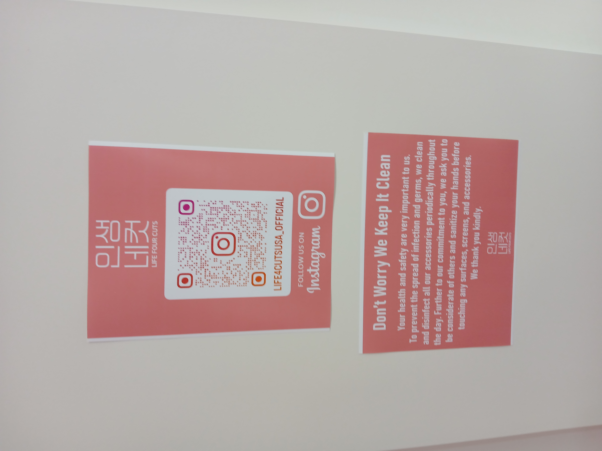
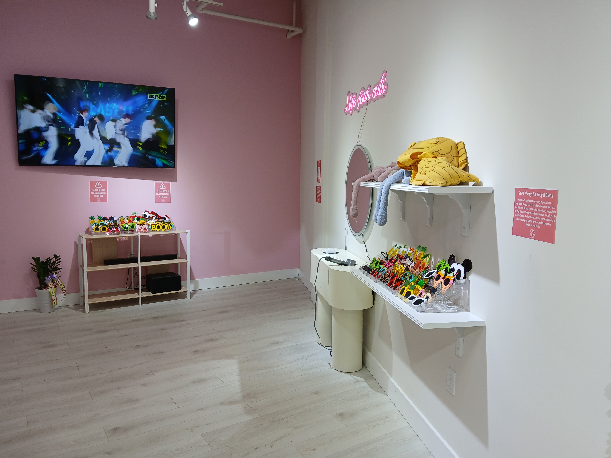
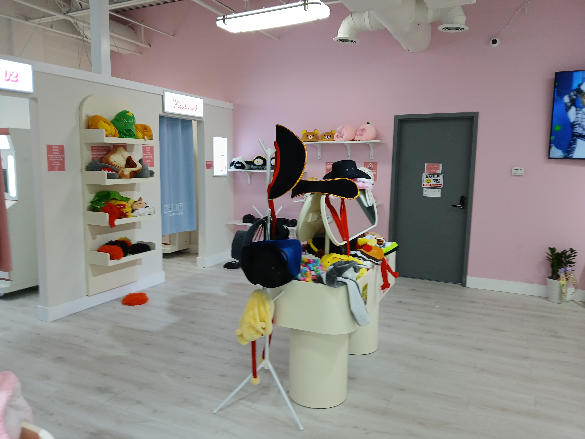
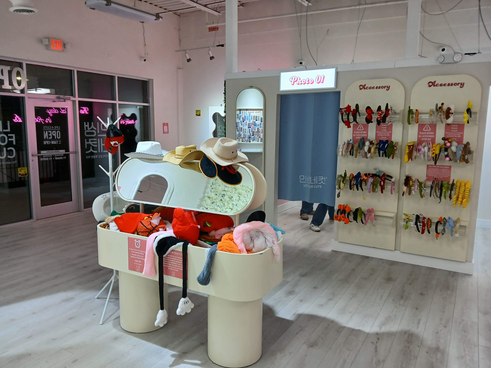
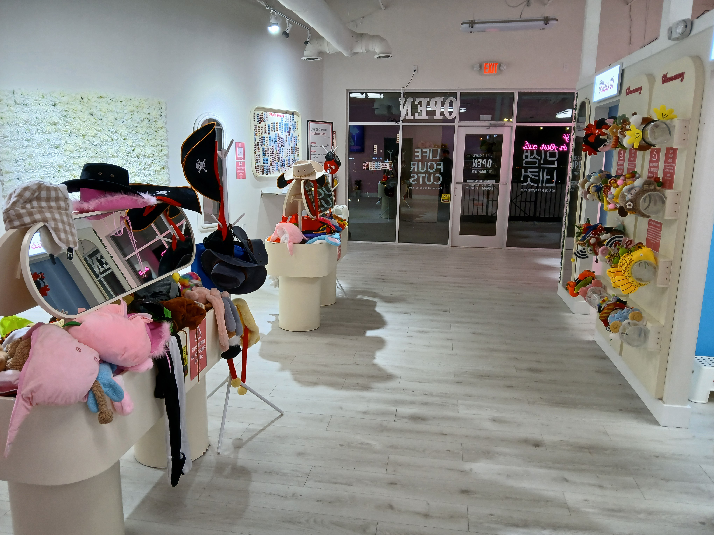

# Meeting Summary

## 12/26/2024

### Participants
- Jaehoon Song
- Sowon Lim
- Subeen Kim
- Seungheon Kim
- Sanghyun An

### Topics Considered
1. **Smart Waste Management and Upcycling Solutions**
   - AI-powered waste sorting and upcycling.
   - Focus on sustainability and innovative recycling.

2. **Global Photo Booth Concept**
   - Accessible, customizable photo booth service inspired by '인생네컷.'
   - Integration of QR codes for mobile access and local collaborations.

3. **Sound and Screen Synchronization for Bluetooth Devices**
   - Real-time syncing of audio and video for Bluetooth devices.
   - Support for multi-device compatibility and cloud updates.

4. **Virtual Assistant Service**
   - Personalized task management for individuals and businesses.
   - Features include schedule and email management, smart analytics, and multi-device integration.

5. **Travel Service App**
   - A platform for sharing travel records, hidden gems, and recommendations.
   - Personalized travel diaries with smart recommendations and social connectivity.

### Final Decision
After thorough discussion and weighing the pros and cons of each idea, we decided to proceed with the **Global Photo Booth Concept**.

## Finalized Idea: Global Photo Booth Concept

### Objectives
To introduce a globally accessible photo booth experience, offering customizable features and a localized, engaging user experience.

### Key Features
- **QR Code Integration**: Easy access to photos on mobile devices.
- **Custom Frames and Filters**: Collaborations with local icons to attract diverse audiences.
- **Hardware & Software**: High-quality cameras, touchscreens, and user-friendly interfaces.

### Market Opportunity
- Strong demand for photo booth services at events and attractions.
- Appeals to social media users seeking unique and interactive experiences.

### Next Steps
1. Develop a prototype booth with basic hardware and software.
2. Identify pilot locations for testing and feedback collection.
3. Explore partnerships with local businesses and influencers.

### Expected Outcomes
- A fun and interactive way for users to capture memories.
- Enhanced visibility through collaborations and social media sharing.
- Potential for scaling and expansion across global markets.

---

## 12/30/2024

### Agenda
GitHub Setup, Repository Creation, and GPB (Global Photo Booth) Conceptualization.

### Key Actions
1. **GitHub Setup and Repository Creation**:
   - Learned GitHub usage through Jaehoon's code and guidance.
   - Created and set up a shared repository for team collaboration.

2. **Global Photo Booth Concept Design**:
   - Decided to use a **web-based design** with standalone printers instead of traditional photo booth machines.
   - **Advantages of a Web-Based Design**:
     - Improved user accessibility: Users can take and edit photos directly on their mobile devices.
     - Reduced initial investment and increased space efficiency by eliminating the need for large machines.
   - **Challenges Identified**:
     - Need alternatives for users who prefer the physical photo booth experience.
     - Address potential quality issues for users with low-resolution mobile cameras.
   - **Conclusion**: Despite challenges, the benefits of a web-based approach outweigh the drawbacks, making it the preferred solution.

3. **Market Strategy**:
   - Highlighted cost-effectiveness and easy maintenance compared to traditional bus-style or stationary photo booths.
   - **B2B Clients**:
     - Simple installation and removal of printer booths during crowded events.
     - Minimal setup time and cost, making it suitable for temporary or high-traffic events.
   - **End Users**:
     - Instant photo access and ability to share experiences with companions.
   - **Venues and Organizers**:
     - Enhanced user experience and increased profits through revenue-sharing agreements.

---

## 01/05/2025

### Agenda
Backend and Frontend Integration.

### Key Actions
1. Jaehoon developed a **web framework** to connect the backend and frontend.
2. Conducted hands-on application and testing of the framework within the project.

### Outcome
- Successfully integrated backend and frontend components.
- Determined that the current UI, developed by Seungheon, is a demo version and not ready for full backend connection.
- Decided to:
  - Add an **admin-specific client** to Seungheon’s frontend design for backend testing.
  - Verify the backend-admin client connection using provided scripts.

---

## 01/07/2025

### Milestones
- **Version 1.0.0 Released**:
  - Focuses on minimal functionality and foundational features.
  - **Future Plans**:
    - Develop a fully designed UI/UX using tools like Figma or Adobe.
    - Launch **Alpha/Beta (2.0.0)** version with enhanced features.
    - Continue making minor/patch updates to version 1.0.0 until the major release.

---

## 01/10/2025

- **Documentation Updates**:
  - Modularized documentation into business and technical categories:
    - Business:
      - [Project Vision](./business/project_vision.md)
      - [Project Bid](./business/project_bid.md)
      - Three of contract documents
    - Technical:
      - [Functional Requirements](./technical/functional_requirements.md)
      - [Non-Functional Requirements](./technical/non_functional_requirements.md)

---

### **2025/01/12**
- **First In-Person Meeting**:
  - Held the first face-to-face meeting to discuss previous contracts, Git setup, and environment settings.

#### **Key Discussion Points**

1. **Contract Review**:
   - Reviewed the previously drafted contracts (confidentiality and profit-sharing agreements).
   - Identified a need for major revisions in the contracts.
   - Decided that **Sowon** will consult with Yeongwon's other co-founders regarding our preferred working model.

2. **Preferred Working Model**:
   - Our team prefers an **outsourcing model**:
     - We aim to develop an open-source software program.
     - The program will be licensed and sold directly to clients like companies or stadiums requiring our services.
   - Licensing Details:
     - Yeongwon would be our **first client** if they agree to this model.
     - Software licensing includes:
       - Development of the program.
       - Customization of frontend and features based on client requirements.
       - Predefined periods for updates and maintenance as part of the license agreement.

3. **Environment Setting**:
   - Learned about configuring development environments using scripts.
   - Topics covered:
     - Setting up `.bashrc` and other shell scripts to automate environment setup.
     - Creating virtual environments to quickly execute and test software directly on the machine.
   - Improved understanding of efficient development workflows.

---

## Image References

## 01/12/2025

The following images provide visual documentation related to the picture booth report:

- Notice with **QR Code** and Official Site **Reference**

    

- Example Booth (**인생네컷** at ASSI Plaza)

    

    

    

    

- **인생네컷** UX video
  - The following video provides additional context:

    <video width="640" height="360" controls>
        <source src="videos/20250112_1759062.mp4" type="video/mp4">
        Your browser does not support the video tag.
    </video>

